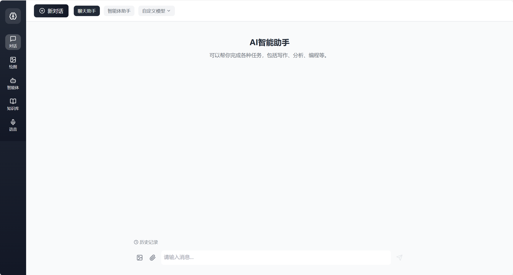
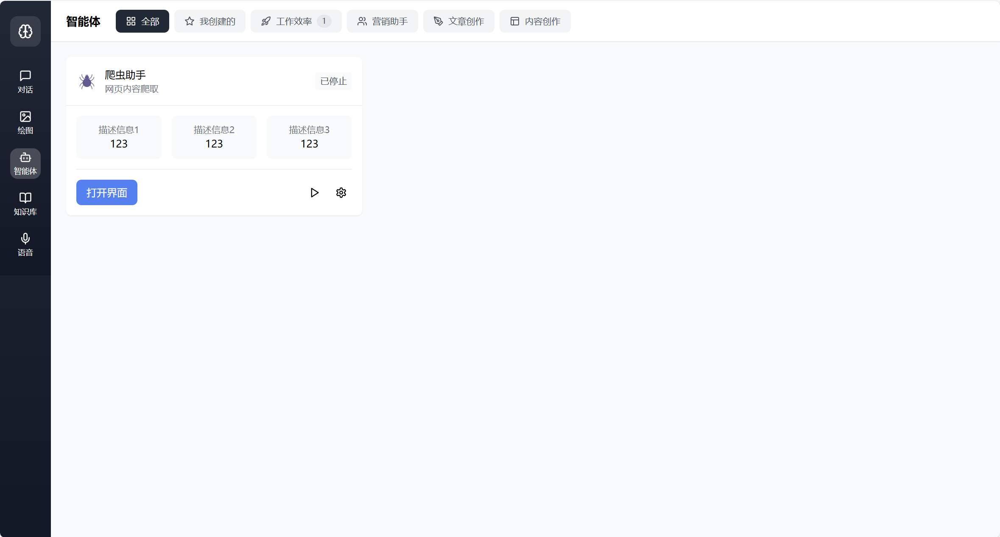
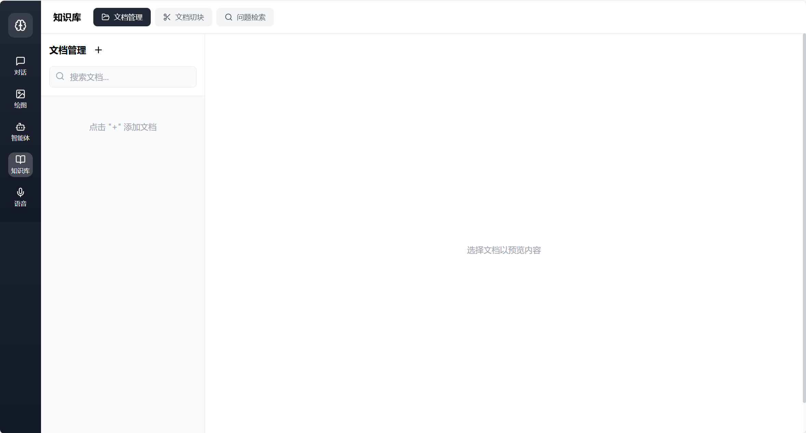
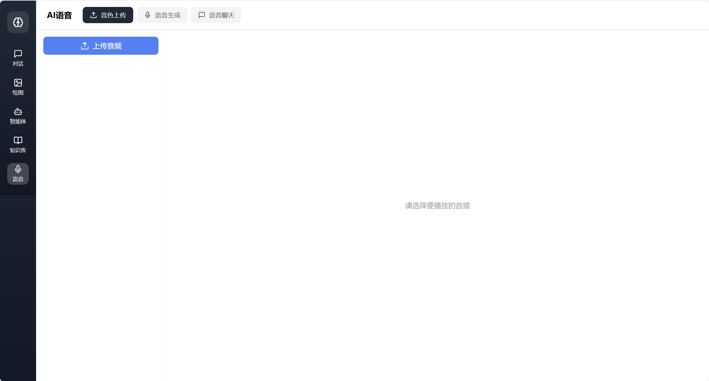

# AIChat_UI

## 目录

- [项目简介](#项目简介)
- [npm安装](npm安装)
- [界面展示](#界面展示)
- [测试结果内容](#测试结果内容)

## 项目简介
基于React搭建AIChat的UI界面
```bash
打开终端，进入你想创建项目的目录
npx create-react-app aichat_ui
cd AIChat_UI
替换src下的内容即可 tailwind.config.js和postcss.config.js放到项目目录下
```
控制台输入
```bash
npm install tailwindcss
npx tailwindcss init
npm install lucide-react
npm install clsx tailwind-merge zustand @radix-ui/react-dialog @radix-ui/react-scroll-area tailwindcss-animate

```

## npm安装
安装教程:[链接](https://blog.csdn.net/zhouyan8603/article/details/109039732)

## 界面展示
聊天界面  聊天模式操作示例[预览视频](https://drive.google.com/file/d/1isQEu9rNgEd_eL6rq5ju_069GBbbr-Ab/view?usp=drive_link)


绘图界面


智能体界面


知识库界面


语音界面


## 测试结果内容

可参考demo中的图像
